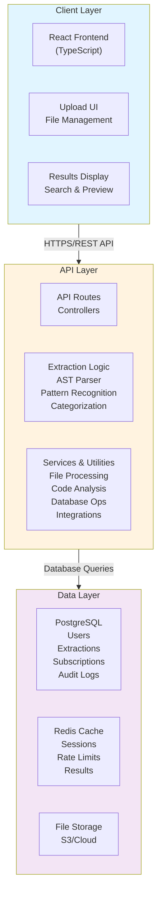
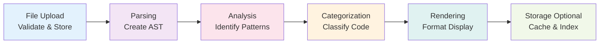
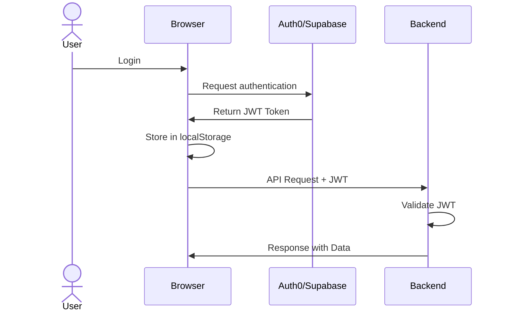
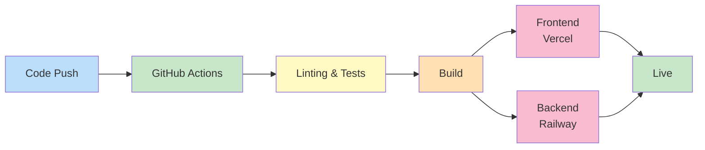

# Parsnipt Architecture

## Overview

Parsnipt is a full-stack web application built with React (frontend) and Express.js (backend). This document describes the system architecture, design decisions, and how components interact.

## System Architecture



## Technology Stack

### Frontend
- **Framework:** React 18+ with TypeScript
- **Editor:** Monaco Editor (code syntax highlighting)
- **Preview:** React-Sandpack (component sandboxing)
- **State:** Zustand (lightweight state management)
- **Styling:** Tailwind CSS
- **HTTP Client:** Axios or Fetch API
- **Build Tool:** Vite or Create React App

### Backend
- **Runtime:** Node.js 18+
- **Framework:** Express.js
- **Language:** TypeScript
- **AST Parsing:** @babel/parser (JavaScript/TypeScript)
- **Code Generation:** Recast
- **Database:** PostgreSQL (primary), Redis (cache)
- **Authentication:** Auth0 or Supabase Auth
- **File Storage:** AWS S3 or Cloudinary

### DevOps & Deployment
- **Frontend Hosting:** Vercel or Netlify
- **Backend Hosting:** Railway, Render, or AWS
- **Database:** Managed PostgreSQL service
- **Monitoring:** Sentry (errors), DataDog (performance)
- **CI/CD:** GitHub Actions

## Key Concepts

### Code Extraction Pipeline

1. **File Upload**
   - User uploads source code file
   - Server validates file size, type, encoding
   - File stored temporarily in object storage

2. **Parsing**
   - Babel parser creates AST from code
   - Error handling for invalid syntax
   - Support for JSX, TypeScript syntax

3. **Analysis**
   - AST traversal to identify code patterns
   - Pattern matching for functions, components, algorithms
   - Metadata extraction (names, parameters, types)

4. **Categorization**
   - Heuristic-based classification
   - Naming conventions analysis
   - Complexity metrics
   - Dependency tracking

5. **Rendering**
   - Format extracted code for display
   - Generate preview for components
   - Prepare export formats (JSON, Markdown)

6. **Storage (Optional)**
   - With user consent, store extraction results
   - Index for future search
   - Maintain audit trail



### Authentication Flow

User Login → Auth0/Supabase → JWT Token → Stored in Browser↓API Request with JWT → Backend Validation → Route Handler↓Response with Data


### Rate Limiting Strategy

- Free tier: 10 requests/day
- Pro tier: 100 requests/day
- Enterprise: Unlimited
- Implementation: Redis-based counter with sliding window

## Database Schema (Phase 1)

### Users Table
| Column | Type | Constraints |
|--------|------|-------------|
| id | UUID | PRIMARY KEY |
| email | VARCHAR(255) | UNIQUE NOT NULL |
| name | VARCHAR(255) | NULL |
| tier | VARCHAR(50) | DEFAULT 'free' |
| created_at | TIMESTAMP | DEFAULT NOW() |
| updated_at | TIMESTAMP | DEFAULT NOW() |

**SQL:**
```sql
CREATE TABLE users (
  id UUID PRIMARY KEY,
  email VARCHAR(255) UNIQUE NOT NULL,
  name VARCHAR(255),
  tier VARCHAR(50) DEFAULT 'free',
  created_at TIMESTAMP DEFAULT NOW(),
  updated_at TIMESTAMP DEFAULT NOW()
);
```
### Extractions Table

| Column | Type | Constraints |
|--------|------|-------------|
| id | UUID | PRIMARY KEY |
| user_id | UUID | REFERENCES users(id) |
| file_name | VARCHAR(255) | NOT NULL |
| file_size_bytes | INT | NOT NULL |
| extraction_results | JSONB | NULL |
| created_at | TIMESTAMP | DEFAULT NOW() |

**SQL:**
```sql
CREATE TABLE extractions (
  id UUID PRIMARY KEY,
  user_id UUID REFERENCES users(id),
  file_name VARCHAR(255) NOT NULL,
  file_size_bytes INT NOT NULL,
  extraction_results JSONB,
  created_at TIMESTAMP DEFAULT NOW()
);
```
### Audit Logs Table

| Column | Type | Constraints |
|--------|------|-------------|
| id | UUID | PRIMARY KEY |
| user_id | UUID | REFERENCES users(id) |
| action | VARCHAR(255) | NOT NULL |
| details | JSONB | NULL |
| created_at | TIMESTAMP | DEFAULT NOW() |

**SQL:**
```sql
CREATE TABLE audit_logs (
  id UUID PRIMARY KEY,
  user_id UUID REFERENCES users(id),
  action VARCHAR(255) NOT NULL,
  details JSONB,
  created_at TIMESTAMP DEFAULT NOW()
);
```

**API Design Principles**

• RESTful: Standard HTTP methods (GET, POST, PUT, DELETE)

• Versioning: API routes namespaced (/api/v1/…)

• Error Handling: Consistent error response format

• Documentation: OpenAPI/Swagger spec (Phase 2)

• Rate Limiting: Per-user rate limiting headers

• Caching: Cache-Control headers for appropriate endpoints

**Security Considerations**

1. Input Validation

    • File type validation

    • File size limits

    • Code injection prevention

2. Authentication & Authorization

    • JWT for API authentication

    • Role-based access control

    • Session management

3. Data Protection

    • HTTPS/TLS in transit

    • Encryption at rest (passwords, sensitive data)

    • No plaintext storage of secrets

4. Component Preview Safety

    • Sandboxed iframe execution (Sandpack)

    • CSP headers to prevent injection

    • Timeout protection for infinite loops

5. Audit & Logging

    • Track all extraction operations

    • Log security events

    • Maintain audit trail for compliance

**Scalability Considerations**

*Current (Phase 1)*

• Vertical scaling: Upgrade server resources

• Single region deployment

*Future (Phase 2+)*

• Horizontal scaling with load balancers

• Database replication and sharding

• CDN for static assets

• Microservices for specialized operations

• Caching strategies optimization

**Error Handling**

All API endpoints return consistent error format:

{
  "success": false, 
  "error": {
    "code": "INVALID_FILE_TYPE",
    "message": "Uploaded file must be JavaScript or TypeScript",
    "details": {}
  }
}

**Testing Strategy**

• Unit Tests: Jest for individual functions

• Integration Tests: API endpoint testing

• E2E Tests: Playwright for user workflows

• Coverage Target: >80%

**Deployment Pipeline**


**Future Improvements**

• Multi-language support with Tree-sitter

• GraphQL API alternative

• WebSocket for real-time updates

• Advanced caching strategies

• Machine learning for pattern recognition

• IDE plugin integrations